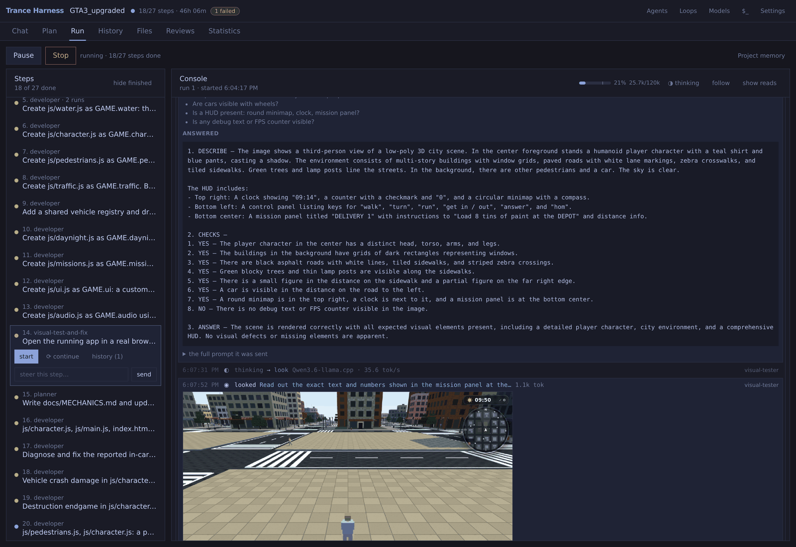
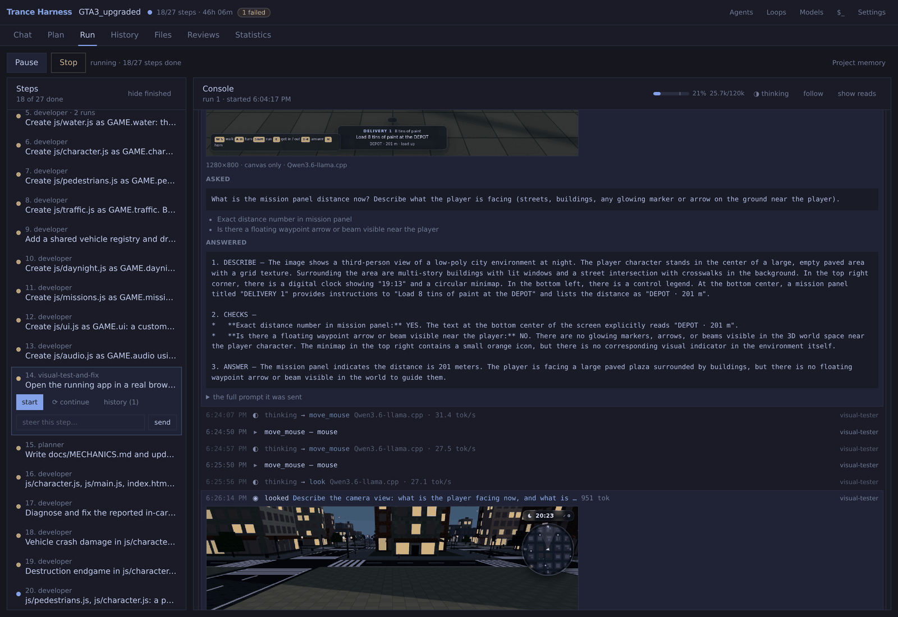

# trance

A multi-agent coding harness that plans, builds, and **end-to-end tests** what
it built: a visual tester drives the app in a **real headless Chrome** — keys,
clicks, screenshots — and a vision model judges what is on screen. Every frame,
question and keypress is in the history, openable.


*The tester presses W, measures that the screen changed, then **watches** — six
frames over 120 animation frames, sent to the vision model as one sequence:
"does the player's pose change?" It answers no: the clock advances, the camera
moves, the legs never swing. A real animation defect. Game, tests and verdicts
from a local Qwen3 27B (120k context) on one RTX 3090.*

Built around one constraint: **keep the context small**, so ordinary local
models can work on real codebases. A 33KB file is ~8,400 tokens; the function
you need is 150. A call graph names what a task touches, and agents fetch
symbols instead of the files they live in.

```
trance serve            # http://localhost:8080
```

---

## What it does

- **End-to-end visual testing.** `open_page` starts the project's own dev
  server on a free port; `press_key` / `click` / `watch` interact and film; a
  vision model answers pointed questions with evidence per check. Failures
  route back to the developer.
- **Plans.** Describe a project; the orchestrator proposes a team and an
  ordered flow. Editable, size-estimated, nothing runs until you press Run.
- **Runs, visibly.** A live console: every model call, command, diff, lookup
  and verdict, with a context gauge on the working step.
- **Remits, enforced.** Each agent owns path globs, a toolset and a command
  allowlist, checked at the tool boundary. A refusal can ask you: allow once,
  always, or refuse.
- **Checks.** Verifier chains on every step. A failed check sends the work
  back with the objection.
- **Steering.** Type mid-run; it reaches the working agent on its next round.
- **Git as the record.** Every step runs between two commits. Per-step revert
  and apply, one inverse commit each.
- **Statistics.** Tokens per model, working time per agent, and where the
  clock went — reading context, generating, running tools.
- **Cleanup.** Nothing an agent starts outlives the run; Stop means now.
- **Review.** Comment on lines, send the review as a step. Serve any page on
  your network or tunnel it out.

---

## Screens

One chat request, end to end: the sentence you typed, the assumptions the
orchestrator committed to, the plan, and the commits with diffs.


Where the time and tokens went — per agent, per model, live while a run works.


| | |
|---|---|
| **Chat** | Name a project, describe it, talk to the orchestrator. |
| **Plan** | The flow editor: steps, agents, check chips. |
| **Run** | The pipeline, and a live console of the working agent. |
| **History** | What each request produced, or the plain git log. |
| **Files** | Tree, editor, line review, serve/start/clear. |
| **Reviews** | Every review you sent and what came of it. |
| **Statistics** | Tokens, calls, time — per agent and per model. |

Four modals — **⚙ Models**, **👥 Agents**, **↻ Loops**, **$_ Commands** — same
shape: a list down one side, the one you picked filling the pane. More in
[docs/screens/](docs/screens/).

---

## The pieces

### Models

A model is one definition: the API it speaks, where it lives, the key, the
model id. Its name is the handle you attach to an agent.

| kind | client |
|---|---|
| `anthropic` | official Anthropic SDK (`POST /v1/messages`) |
| `openai` | OpenAI-compatible `/chat/completions` |
| `ollama` | OpenAI-compatible, local |
| `llamacpp` | OpenAI-compatible, local (llama-server) |
| `claudecode` | the local `claude` CLI, on its subscription — no key, no endpoint |

The model id offers what the endpoint reports (`/models`, in the OpenAI,
llama-server and Anthropic shapes) and stays free text when it will not say.
**Test** sends a one-token probe and reports the URL it actually called.

**Claude Code is not an ordinary backend.** Use it for steps that are one act
of judgment — architecture, planning documents, reviews, a hard escalation
after the local model failed twice. Not for ordinary coding steps. Measured
here:

- The CLI throttles programmatic use, so the whole step is handed over as
  **one call**. Its internal turns stream into the console, but there is no
  context gauge and no steering mid-step.
- It codes with **its own tools**. Remits and allowlists are judged from the
  git diff afterwards, not enforced as writes happen — the one backend where
  the guardrails are post-hoc. A write outside the remit still fails the step.
- Cost scales with the square of step size: every internal turn re-sends the
  whole conversation. 64–83 turns and 1.5–2.7M input tokens on single coding
  steps, and **a retry pays the whole step again**.

So a step on this model is **delegated**: one call, its own loop, its own
context management. trance still decides which step runs, with what prompt,
and judges it by the same `OUTCOME:` line and the same checks. Verifier turns
carry the step's **diff in the prompt** — without it, one measured review
spent thirty internal turns rediscovering what `git show` knew. Statistics
splits **cache re-reads** out of the input count, which is 20× otherwise. A
step past 40 internal turns is flagged while it runs: split it.

Set the model id — empty means the CLI's default, which is opus, on every
step. Whether this fits your subscription is a licensing question.

### Agents

An agent is a name, a prompt, a **remit** (path globs it may write), a
**toolset**, a **command list**, a **tool-round budget**, a model, and
optionally a **backup model**:

```
Model          local — unsloth/Qwen3-27B-GGUF        tries [2]
Backup model   claude — claude-opus-5                tries [2]
               4 tries in all — 2 on the model, then 2 on the backup.
```

The retry loop varies the prompt, never the model, so an agent that fails the
same way twice fails the same way a third time. The backup is the switch for
that; a 503 goes to it immediately.

**Tool rounds** is how many reads, writes or commands one attempt gets before
it must stop and report. Running out is how a step ends half-written, so the
shipped numbers come from measured runs: tester, backend and frontend 24, the
reviewer 20, everything else twelve.

Toolsets: `files` (read/write within the remit), `graph` (symbol lookups),
`commands` (allowlisted programs), `inspect` (existence and size only — for
verifiers that must not do the work themselves).

An agent carries **checks** — verifiers that run after every step it does,
shown as chips you can take off. Set once on the agent, copied onto its steps
and loop nodes; a removed chip stays removed.

Ships with planner, developer, tester, visual-tester, reviewer, regression and
the orchestrator. All editable; a new agent starts from a template with the
parts to replace marked «like this».

**Where definitions live.** Each project keeps copies in `.trance/`; the
**Default** scope is what new projects start from, and it is an *overlay* on
shipped — a built-in you never edited keeps tracking trance's improvements, an
edit freezes that agent, and a changed copy wears a `modified` badge. Reset
walks one hop and keeps your wiring. Deleting is warned rather than walled: a
step naming a deleted agent fails at run time saying so.

### Steps, loops and outcomes

A **step** is one agent attempting one task. It ends with `OUTCOME: SUCCESS`
or `OUTCOME: FAILED — why`; anything else is retried, bounded by the agent's
try count.

A step carries a **chain of checks** run in order — the first FAIL sends the
work back and the whole chain runs again, so a fix that breaks an earlier
check cannot pass. The agent is told what the check found and tries again;
only a check that keeps failing halts the run. The planner model is
deliberately not asked to pick verifiers: asked, it picked from the shape of
the sentence, differently each time.

A **loop** is a reusable block of agents wired by outcome — tester finds a
bug, developer fixes it, tester runs again. Each block's `SUCCESS`, `FAILED`
and `CHECK FAILED` points at another block or leaves the loop, and the number
on an arrow bounds it. A step runs an agent *or* a loop.

Arrows come in **tiers**, so a loop can change tactic rather than repeat:

```
on FAILED   1st–2nd  → developer                        [ ] backup model
            3rd–4th  → developer                        [x] backup model
            after 4, the loop halts
```

Deliberately not a general graph language: every arrow is labelled with an
outcome the engine already computes.

### Keeping the context small

- **Symbols, not files.** A large indexed file answers `read_file` with its
  outline; `get_definition` returns any symbol in full. Five whole-file reads
  cost 12,900 tokens; 2,100 this way.
- **Edits, not rewrites.** `edit_file` replaces an exact snippet;
  `replace_symbol` swaps one function by its recorded byte range. A 15-line
  change in a 1,187-line file: ~150 tokens instead of ~8,400.
- **Your own output stops costing.** Past `write_file` calls keep their path
  and lose their content — the bytes are on disk.
- **Repeats become pointers.** The same lookup twice answers "you already have
  this above", unless the earlier copy was trimmed away.
- **The budget is calibrated** against the endpoint's own `prompt_tokens`, not
  a chars/4 guess that runs low exactly where code is dense.
- **Libraries answer by name.** The `.d.ts` surface of direct dependencies is
  indexed behind a lockfile fingerprint — Phaser's public API in one pass.
  Symbols wear their package: `[phaser] Scene`. Implementations stay
  unindexed.
- **Shared memory.** Decisions others must match — a route shape, a port, the
  test command — go to `.trance/memory.md`, compacted when it outgrows its
  budget.

### Visual testing

An agent with the `browser` toolset opens the project in a real headless
Chrome. It can **press keys**, **click buttons by their words**, **wait** in
animation frames, run cheap mechanical checks (did it paint; is the picture
still changing), **look** — one screenshot, one question — and **watch**: a
filmed burst sent as one sequence, for what a single picture cannot answer.
The console plays the burst back as a flick-book.

**A real session.** A GTA3-style city explorer — driving, missions, day and
night, a crowd — every line written, tested and visually judged by a local
Qwen3 27B on one RTX 3090. No API, no cloud. A frame and its reading:
DESCRIBE, then each CHECK with its evidence, then the verdict.



The same rigor the other way. The panel says the depot is 201 m off, so the
tester asks what the player can actually see — and answers **NO**, with the
reason: an orange pip on the minimap, and no marker anywhere in the world.



`open_page` starts the project's **own dev server** when it needs one (a Vite
app served statically dies on its first import), with a free port injected as
`PORT`, and stops it when the step ends. It also checks **identity**: if what
answers is not this project, that is said first and loudest.

### Git

Every block runs between two commits: a checkpoint before, a commit of what it
did after. `revert on failure` is opt-in per step and per loop block, and uses
`git revert` rather than `reset --hard`, so a reverted attempt is still
readable. Whatever was in the tree before the run is committed first, so a
revert can only take back the agent's own changes.

### The trace

Every model call, tool call, refusal, commit and outcome is an event. Events
go to the browser live and to `<session>/events.jsonl` on disk, so a finished
step is still explorable after a restart.

---

## Install

Requires Python 3.11+ and git. [uv](https://docs.astral.sh/uv/) recommended.

```bash
git clone https://github.com/pjpetrov/trance
cd trance
uv sync --all-extras
uv pip install -e .

trance serve
```

Point it at a model — locally that is llama-server or Ollama already running;
otherwise add an API key in ⚙ Models.

```bash
trance serve -w ~/projects          # where new projects are created
trance serve --host 0.0.0.0         # network-visible; read the warning it prints
trance serve --runs-dir ./runs      # legacy state dir
```

## Sharing a preview (optional)

**▷** in the Files tab serves a page's folder on your network. To send it
further, trance can put it behind an HTTPS tunnel. This needs
[ngrok](https://ngrok.com/download), which is not a dependency: without it the
sharing controls do not appear.

```bash
ngrok config add-authtoken <token from dashboard.ngrok.com>
```

Then **share…** next to *serving*. Nothing is published until you press it,
and stopping the preview stops the tunnel. A free ngrok account allows one
agent, so trance reuses the one you have rather than starting a rival.

Two things before you send the link:

* **There is no password.** Anyone with the URL can read *every file in that
  folder*. Keep secrets out of it.
* **A browser sees ngrok's warning page first** and has to click through.

With a password instead:

```bash
tools/preview-tunnel.sh             # generates a password on first run
tools/preview-tunnel.sh --open      # no password, same as the UI button
tools/preview-tunnel.sh s_1a2b3c4d  # when several sessions are serving
```

A tunnel started this way appears in the UI too. Set `TRANCE_NGROK_API` if
your agent is not on the default port.

A Vite or webpack project uses **start app** instead of the static server: the
orchestrator reads the README, shows the exact command, and runs it after your
yes, with a free port as `PORT`. Sharing writes the tunnel host into Vite's
`allowedHosts` mechanically. What each session serves is remembered, so a
preview survives a restart.

## Where configuration lives

A project keeps its configuration in `<repo>/.trance/` — `agents.json`,
`loops.json`, `commands.json`, `settings.json` — so copying that folder copies
the way the project is built. Sessions live there too, under
`.trance/sessions/`.

The machine keeps what is genuinely the machine's at `system_dir`: the models
(`providers.json`, with their API keys — never copied into a project), the
settings, and the usage ledger. The workspace's `.trance/` holds the
**Default** scope its projects are provisioned from, an overlay on
`trance/defaults/*.json`.

The graph index is `<repo>/.trance/graph.db`.

## Tests

```bash
pytest                       # the Python side — parallel by default (-n auto)
cd ui && npm test            # the interface, in jsdom
cd ui && npx tsc --noEmit    # types
```

The UI tests fake only `fetch`, so they assert what the server was actually
asked for rather than that a render did not throw.

## Layout

```
src/trance/
  indexer/     tree-sitter parsing → SQLite symbol + call graph, incremental
  mcp_server.py  the project's tools as an MCP server (standalone)
  curator/     N-hop walk → minimal bundle under a token budget
  agents/      roles, tools, runner, memory, approvals, handoff
  providers/   model clients and the registry
  server/      FastAPI + websocket; ui/ is the built interface, committed
  engine.py    the flow engine: steps, loops, checks, escalation
  loops.py     the loop state machine
  vcs.py       git checkpoints
ui/            React, TypeScript, TanStack Query, Tailwind
```

The interface is built from `ui/` into `src/trance/server/ui/`, **and the
build is committed** — that is what keeps `pip install` enough. So rebuild
before committing a UI change:

```bash
cd ui && npm install && npm run build
```

## Not done

Import-able, documented in their docstrings, and honest about it — they raise
`NotImplementedError` rather than pretending:

- **LSP-backed resolution** (`indexer/lsp.py`) — pyright /
  typescript-language-server instead of name matching.
- **Frontend ↔ backend linker** (`linker/`) — connecting `fetch` calls to the
  route handlers that serve them.
- **Call-graph visualization.** Every trace already carries what it needs:
  `graph_slice.nodes/edges` is the subset the curator walked, each edge with a
  `resolution` (`same_file`, `ambiguous`, `unresolved`). The whole repo graph
  dimmed with that slice lit up would be the clearest statement of what this
  project is for.

One sharp edge: remit globs use `fnmatch`, whose `*` crosses `/`, so `*.js`
matches `server/app.js` as well as `app.js`. Narrow globs are unaffected.

## Licence

MIT — see [LICENSE](LICENSE).

Bundles [CodeMirror 5](https://codemirror.net/5/) (MIT) in `ui/public/vendor/`,
vendored so the file editor works offline.
