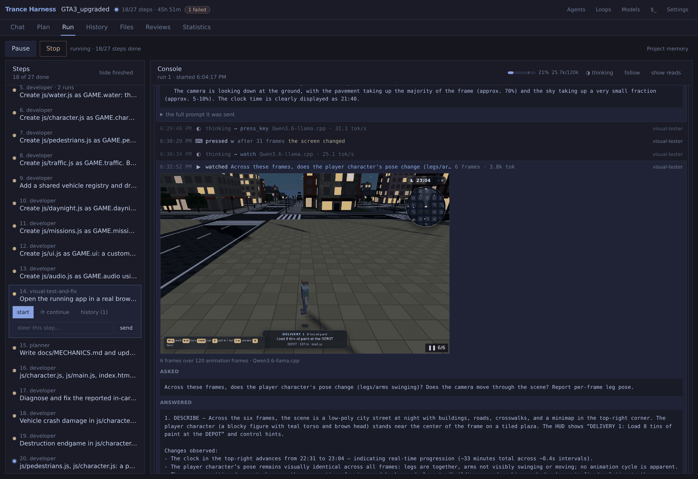
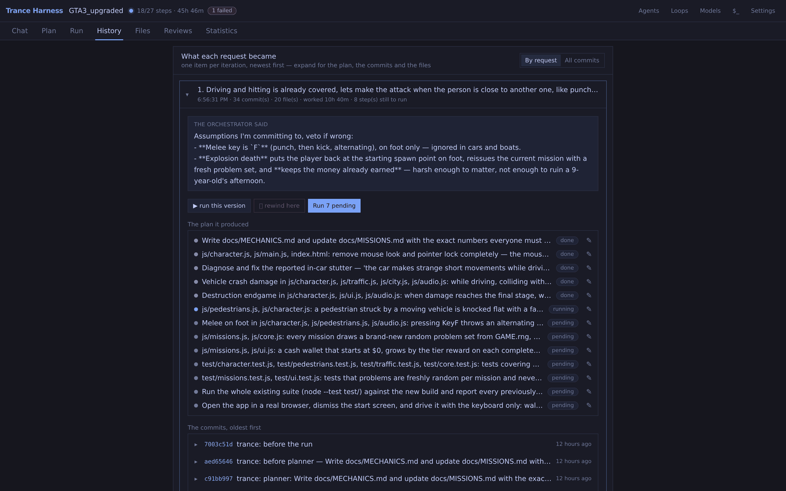
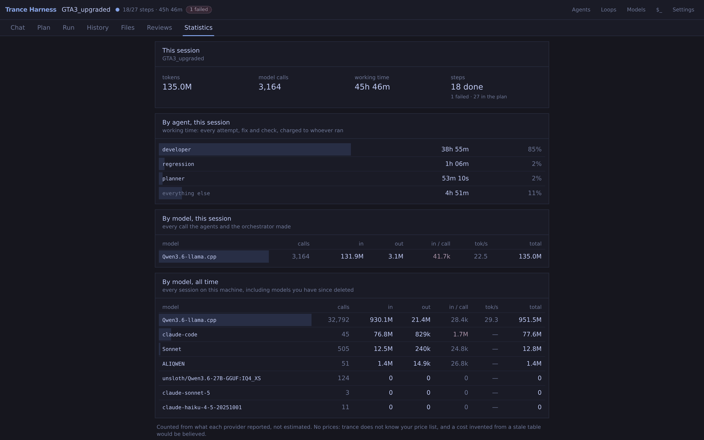
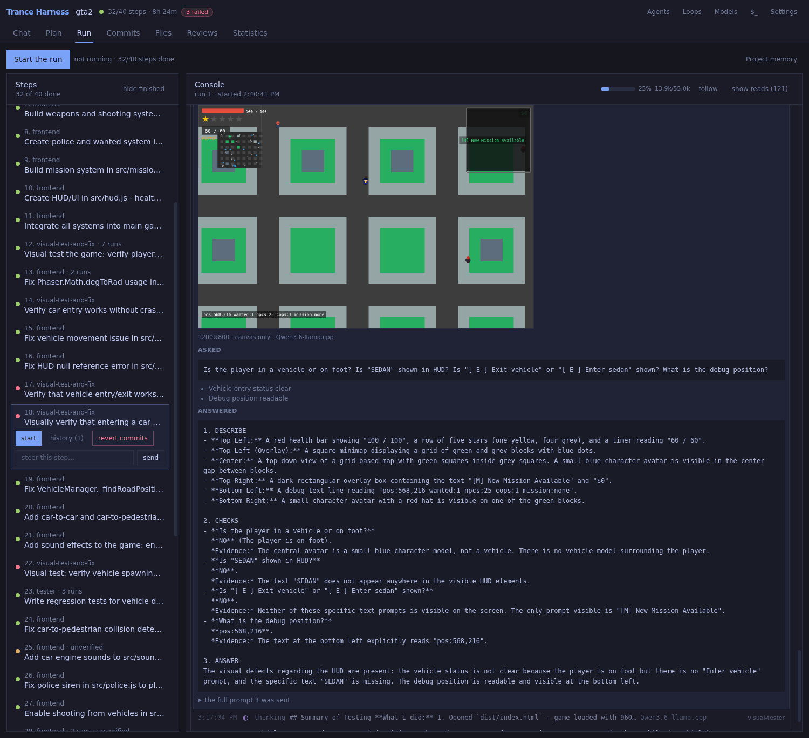
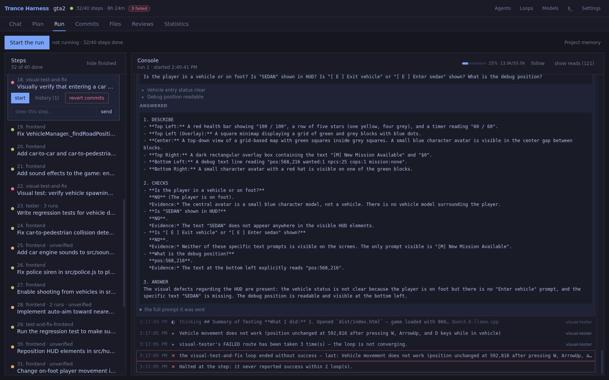

# trance

A multi-agent coding harness that plans, builds, and **end-to-end tests** what
it built: a visual tester drives the app in a **real headless Chrome** — keys,
clicks, screenshots — and a vision model judges what is actually on screen.
Every frame it saw, every question it asked, every key it decided to press is
in the history, openable and checkable.



*Straight from the run history: the tester presses W — "the screen changed"
measured per press — then **watches**, filming six frames over 120 animation
frames and sending them to the vision model as one sequence: "does the player
character's pose change (legs/arms swinging)?" The answer is underneath, and
it is a defect — the clock advances, the camera moves, and the legs never
swing. Game, tests and verdicts all from a local Qwen3 27B (120k context) on
one RTX 3090.*

Built around one constraint: **keep the context small**, so ordinary local
models can work on real codebases. A 33KB file is ~8,400 tokens; the function
you need is 150. A call graph names what a task touches, and agents fetch
those symbols instead of the files they live in.

```
trance serve            # http://localhost:8080
```

---

## What it does

- **End-to-end visual testing.** A real browser, driven: `open_page` starts
  the project's own dev server on a free port, `press_key` / `click` /
  `watch` interact and film, a vision model answers pointed questions with
  evidence per check. Failures route back to the developer.
- **Plans.** Describe a project; the orchestrator proposes a team and an
  ordered flow. Editable, size-estimated, nothing runs until you press Run.
- **Runs, visibly.** A live console: every model call, command, diff, lookup,
  verdict — with a context gauge on the working step.
- **Remits, enforced.** Each agent owns path globs, a toolset and a command
  allowlist, checked at the tool boundary. Refusals can pause and ask you:
  allow once, always, or refuse.
- **Checks.** Verifier chains on every step — the reviewer by rule on anything
  that writes; regression, or your own as chips on agents, steps and loop
  nodes. A failed check sends the work back with the objection.
- **Steering.** Type mid-run; it reaches the working agent on its next round.
- **Git as the record.** Every step runs between two commits. Per-step
  **revert commits** / **apply commits**, one inverse commit each, all acts
  in history. The Commits page: per-request view or plain git log.
- **Statistics.** Tokens per model, working time per agent — every attempt,
  fix and check charged to whoever ran — live, with the answering model
  pulsing.
- **Cleanup.** Nothing an agent starts outlives the run; Stop means now.
  **Clear all** wipes the build but keeps `.trance/` and history, as a
  commit. Deleting a session takes its directory, guarded.
- **Review.** Read the code, comment on lines, send the review as a step.
  Serve any page on your network, run the real dev server, or tunnel it out.

---

## Screens

What one chat request turned into — the sentence you typed, the assumptions
the orchestrator committed to before building, the plan it became, and the
commits it produced, diffs and all. The audit trail from "let's make the
attack when the person is close to another one, like punching" to
`js/character.js`:



Statistics — where the time and tokens actually went: working time charged per
agent, tokens per model with the cached share called out, all of it live while
a run works:



| | |
|---|---|
| **Chat** | Name a project, describe it, and talk to the orchestrator. |
| **Plan** | The flow editor: steps, their agents, and the check chips on each. |
| **Run** | The pipeline, and a live console of the working agent. |
| **Commits** | Two modes: what each request produced, or the plain git log. |
| **Files** | The tree, a CodeMirror editor, line review, and serve/start/clear. |
| **Reviews** | Every review you sent and what was done about it, from git. |
| **Statistics** | Tokens, calls, working time — per agent and per model. |

Four modals — **⚙ Models**, **👥 Agents**, **↻ Loops**, **$_ Commands** — all the
same shape: what you have listed down one side, the one you picked filling the
pane. More screenshots in [docs/screens/](docs/screens/).

---

## The pieces

### Models

A model is one definition: the API it speaks, where it lives, the key, and the
model id. Its name is the handle you attach to an agent — one thing to define,
one thing to pick.

| kind | client |
|---|---|
| `anthropic` | official Anthropic SDK (`POST /v1/messages`) |
| `openai` | OpenAI-compatible `/chat/completions` |
| `ollama` | OpenAI-compatible, local |
| `llamacpp` | OpenAI-compatible, local (llama-server) |
| `claudecode` | the local `claude` CLI, on its subscription — no key, no endpoint |

**Claude Code as a backend — read this before assigning it.** `claudecode`
reaches Claude through the local `claude` CLI, on its subscription: no key, no
endpoint. It is **not a standard model backend** — it is a cheap way to add a
stronger brain to the harness for the steps that are one act of judgment:
architecture and planning documents, reviews (the diff arrives in the prompt),
a hard escalation after the local model failed twice.

**Do not use it for ordinary coding steps.** The reasons are mechanical, all
measured here:

- The CLI throttles programmatic use, so trance cannot drive it round by
  round — the whole step is handed over as **one call**. Its internal turns
  stream into the console as they happen (what it said, which tool on which
  file), but there is no context gauge and no steering mid-step; usage lands
  as one lump when it exits.
- It codes with **its own tools**. Remits and command allowlists are judged
  from the git diff after the fact, not enforced as writes happen — the one
  backend where trance's guardrails are post-hoc.
- Cost scales with the square of step size: every internal turn re-sends the
  whole conversation. Measured: 64–83 turns and 1.5–2.7M input tokens on
  single coding steps, and **a retry pays the whole step again** — three
  retries of one step burned 6.5M tokens in sixteen minutes of subscription.

A burst of calls comes back `is_error` with zero duration, zero cost and no
request made — the CLI refusing programmatic pace — while the same
conversation succeeds when left alone.

So a step on this model is **delegated**: one call, Claude Code's own loop, its
own tools, its own context management. Measured at nine seconds and three
internal turns for a small edit, in the single call the throttle allows. trance
still decides which step runs, in what order, with what prompt, and judges the
result by the same `OUTCOME:` line and the same checks.

**It costs what a whole step costs.** Measured on four real steps: 12–23 internal
turns each, 340k–740k input tokens, because every turn re-sends the whole
conversation. So the agent's **tool-round budget** is enforced on the tools it is
given — the only lever there is, since the CLI has no turn limit — and the model
id is worth setting: empty means the CLI's default, which is opus, on every step
including the small ones.

A delegated step gets an hour, not the ten minutes a model call gets: it is a
whole step, with its own loop of reads, edits and test runs inside it. If it
does run out, the message says how many tool calls it made and which files it
changed — the work is on disk behind the step's checkpoint.

**It runs with its own tools, and the control is post-hoc.** Measured, the MCP
bridge that used to sit here was never the cost, and its live enforcement
bought little the git diff at the end does not prove better. A role that may
write nothing — a reviewer, a checker — gets read-only tools (Read, Grep,
Glob) and cannot touch the project at all; a writer gets edit permission and a
Bash allowlist shaped from the same command list every other agent answers to.
A write outside the remit still fails the step — judged from the diff when it
finishes. The agents editor says this trade where the model is chosen.

Verifier turns carry the step's **diff in the prompt**, which is what makes
review on this backend affordable: a measured review without it spent thirty
internal turns and 355k tokens rediscovering what one `git show` knew. The
statistics page splits **cache re-reads** out of the input count — a delegated
run re-reads its conversation every internal turn at about a tenth of a fresh
token, and summed raw it reads as 20× the spend it was. A step that goes past
40 internal turns is flagged in the console while it runs, with the advice
that matters: split it, because every retry pays the whole amount again.

Whether using it this way fits your Claude Code subscription is a licensing
question, not a technical one.

The model id offers what the endpoint says it has — trance asks `/models` and
handles the OpenAI, llama-server and Anthropic shapes — and stays free text when
an endpoint will not say, because a listing that misses a model should not lock
it out. **Test** sends a one-token probe and reports the URL it actually called.

### Agents

An agent is a name, a prompt, a **remit** (path globs it may write), a
**toolset**, a **command list**, a **tool-round budget**, a model, and
optionally a **backup model**:

```
Model          Qwen3.6-llama.cpp — unsloth/Qwen3.6-27B-GGUF:IQ4_XS   tries [2]
Backup model   claude — claude-opus-5                                tries [2]
               4 tries in all — 2 on the model, then 2 on the backup.
```

The retry loop varies the prompt and the feedback; it never varies the model, so
an agent that fails the same way twice fails the same way a third time. The
backup is the switch for that, and an endpoint that returns 503 goes to it
immediately — a model that is down does not recover from being asked again.

**Tool rounds** is how many reads, writes or commands one attempt gets before
the agent is made to stop and report. Running out mid-way is how a step ends
half-written with a summary of what it meant to do, so the shipped numbers come
from measuring real runs rather than from intuition: the tester ran out on every
attempt, backend on 83% of attempts and frontend on half. So tester, backend and
frontend get 24, the reviewer 20, and everything else the default twelve.
Override it per agent.

Toolsets: `files` (read/write within the remit), `graph` (symbol lookups),
`commands` (allowlisted programs), `inspect` (file existence and size only — for
verifiers that must not be able to do the work themselves).

An agent also carries **checks** — verifiers that run after every step it
does, shown as chips you can take off. Set once on the agent, they are copied
onto its steps (and its loop nodes) where you can see and change them per
task; a removed chip stays removed. "After every step, run the regression
tests" lives here, not ticked onto twenty steps by hand.

Ships with the planner/architect (whose product is documents: docs/** and
*.md), the developer (both sides of the seam — server, client and the
protocol between them, plus the manifests and build config: scaffolding is
part of the first coding step, not a separate agent's), tester,
visual-tester, reviewer, regression and the orchestrator. All editable; new
ones can be added — a new agent starts from a template with the parts to
replace marked «like this», and one button drafts a first prompt from the
name you gave it.

**Where definitions live.** Each project keeps its own copies in `.trance/`;
the **Default** scope is what new projects start from, and it is an *overlay*
on shipped: a built-in whose definition you never edited keeps tracking
trance's improvements, an edit freezes exactly that agent, and a copy that
differs from its original wears a `modified` badge saying which fields. Reset
walks one hop — a session resets to your Default, the Default resets to
shipped — and always keeps your wiring: model, checks, retries. Deleting is
scoped to the project and warned rather than walled: the first delete names
what still uses the agent, "Delete anyway" is the approval, and a step that
still names it fails at run time saying it was deleted.

### Steps, loops and outcomes

A **step** is one agent attempting one task. It ends with an outcome the agent
states — `OUTCOME: SUCCESS` or `OUTCOME: FAILED — why` — and anything other than
success is retried, bounded by that agent's try count or the step's override.

A step carries a **chain of checks**: independent agents confirming the report
is true, run in order — the first FAIL sends the work back and the whole chain
runs again, so a fix that breaks an earlier check cannot pass. When a check
contradicts a claimed success, the agent is told exactly what the check found
and tries again — a missing file is usually something forgotten, and it can be
finished. Only a check that keeps failing halts the run. Every step that
writes files gets the reviewer by rule — always the same one, chosen by
nobody: the planner model is deliberately not asked to pick verifiers, because
asked, it picked from the shape of the sentence in front of it, differently
each time. Everything above that floor comes from the agents' own chips.

A **loop** is a reusable block of agents wired by outcome — tester finds a bug,
developer fixes it, tester runs again, until it passes or a count runs out. Each
block's `SUCCESS`, `FAILED` and `CHECK FAILED` points at another block or leaves
the loop, and the number on an arrow bounds it. A step runs an agent *or* a loop.

An outcome can also take arrows in **tiers**, which is how a loop changes tactic
instead of repeating one:

```
on FAILED   1st–2nd  → developer                        [ ] backup model
            3rd–4th  → developer                        [x] backup model
            after 4, the loop halts
```

The first two failures go back to the developer as usual; the next two go back
to the same developer on its **backup model**, and the fifth stops. An ordinary
retry varies the prompt and never the model, so "try again" and "try again with
something stronger" are different arrows rather than the same one hoping for a
different result.

Deliberately not a general graph language: every arrow is labelled with an
outcome the engine already computes, so a loop cannot express a condition trance
has no way to evaluate.

### Keeping the context small

This is the point of the project, so it is worth being specific:

- **Symbols, not files.** A large indexed file answers `read_file` with its
  outline — the symbols it defines and their line ranges — and `get_definition`
  returns any of them in full. Five whole-file reads that cost 12,900 tokens
  cost 2,100 this way.
- **Edits, not rewrites.** `edit_file` replaces an exact snippet; `replace_symbol`
  swaps one function using the byte range the parser recorded. Changing a
  15-line function in a 1,187-line file: ~150 tokens instead of ~8,400.
- **Your own output stops costing.** A `write_file` call carries the whole file
  in its arguments and lives in the conversation forever; past writes keep their
  path and lose their content, since the bytes are on disk.
- **Repeats become pointers.** The same lookup twice answers with "you already
  have this above" — unless the earlier copy was trimmed away.
- **The budget is calibrated.** Trimming is enforced against the endpoint's own
  `prompt_tokens`, not a chars/4 guess that runs low exactly where code is dense.
- **Libraries answer by name too.** The indexer takes the `.d.ts` type surface
  of the manifest's direct dependencies — Phaser's whole public API is one
  pass, 10k symbols — behind a lockfile fingerprint so node_modules is walked
  only when the dependencies change. Library symbols rank after the project's
  own and wear their package: `[phaser] Scene`. Implementations stay
  unindexed; grepping node_modules at run_command prices was the alternative.
- **Shared memory instead of re-derivation.** Agents write decisions others must
  match — a route shape, a port, the test command — to `.trance/memory.md`, which
  reaches every later agent and is compacted when it outgrows its budget.

### Visual testing

An agent with the `browser` toolset opens the project in a real headless
Chrome and judges it by what is actually on screen. It can **press keys**,
**click buttons by the words on them** (a lobby with buttons cannot be passed
any other way), **wait** in animation frames, run the cheap mechanical checks
(did it paint, is the picture still changing — said as *still*, with both
readings, because a menu waiting for input looks exactly like a dead render
loop), **look** — one screenshot, one question to a vision model — and
**watch**: a filmed burst of frames sent to the vision model as one sequence,
for the questions a single picture cannot answer — does it move, flicker,
snap back. The console plays the burst back as a flick-book.

**A real session.** A GTA2-style game, every line written, tested and
visually judged by a **local Qwen3.6-27B (64k context) served by llama.cpp on
a single RTX 3090** — no API, no cloud. The history card at the top of this
README is the tester driving that game. And when the game is broken, the same
rigor cuts the other way. Here is the frame it captured and its reading of
it — DESCRIBE what is there, answer each CHECK with the evidence, then the
verdict:



And the same step's ending: the failure routed back, the loop refusing to
call it done —



`open_page` starts the project's **own dev server** behind the page when it
needs one (a Vite app served statically dies on its first import), with a
fresh free port injected as `PORT` — the squatter on your default port is
routed around, never fought — and stops it when the step ends. It also checks
**identity**: if what answers is not this project (a container squatting the
port, answering 200 with its own page), the result says so first and loudest,
before anyone debugs somebody else's app.

### Git

Every block runs between two commits: a checkpoint before, and a commit of what
it did after. `revert on failure` is opt-in per step and per loop block, and
undoes with `git revert` rather than `git reset --hard` — so a reverted attempt
is still readable in history. Whatever was in the tree before the run is
committed first, so a revert can only ever take back the agent's own changes.

### The trace

Every model call, tool call, refusal, commit and outcome is an event. Events go
to the browser live and to `<session>/events.jsonl` on disk, so a finished step
is still explorable after a restart. The step detail groups them by the block
that produced them, folded, one section per attempt.

---

## Install

Requires Python 3.11+ and git. [uv](https://docs.astral.sh/uv/) recommended.

```bash
git clone https://github.com/pjpetrov/trance
cd trance
uv sync --all-extras
uv pip install -e .

trance serve
```

Point it at a model — locally, that is llama-server or Ollama already running;
otherwise add an API key in ⚙ Models.

```bash
trance serve -w ~/projects          # where new projects are created
trance serve --host 0.0.0.0         # network-visible; read the warning it prints
                                    # (file previews are network-visible either way)
trance serve --runs-dir ./runs      # legacy state dir; models and settings
                                    # live at system_dir (see trance.toml)
```

## Sharing a preview (optional)

The ▷ button in the Files tab serves a page's folder on your own network. To
send it to someone who is not on that network — "does this work on your phone?"
— trance can put it behind an HTTPS tunnel. This needs
[ngrok](https://ngrok.com/download), which is not a dependency: without it the
sharing controls simply do not appear.

```bash
# once, on the machine running trance
ngrok config add-authtoken <token from dashboard.ngrok.com>
```

Then in the UI: **▷** on a page to serve it, and **share…** next to *serving*.
trance starts ngrok on that preview's port, shows the public link, and gives you
**stop sharing** to close it again. Nothing is published until you press it, and
stopping the preview stops the tunnel with it.

A free ngrok account allows one agent at a time, so trance works with the agent
you already have rather than starting a rival one: if it is already serving this
preview, that URL is used as is; if it is serving something else, it is pointed
at this preview instead — same session, same URL, and no process of yours is
killed. Only if it refuses is that an error.

Two things to know before you send the link on:

* **There is no password.** Anyone with the URL can read *every file in that
  folder*, not just the page. Keep secrets out of the folder you serve.
* **A browser sees ngrok's warning page first** ("You are about to visit…") and
  has to click through. That is ngrok's free plan; nothing here can turn it off.

From a terminal instead, with a password, which is the better default when the
folder is not just a game you want played:

```bash
tools/preview-tunnel.sh             # writes a policy with a generated password
                                    # on first run, and prints the credentials
tools/preview-tunnel.sh --open      # ...or no password, same as the UI button
tools/preview-tunnel.sh s_1a2b3c4d  # when several sessions are serving
```

A tunnel started this way shows up in the UI too — trance reads the ngrok
agent's local API, so the **share** link appears however the tunnel was started.
Set `TRANCE_NGROK_API` if your agent is not on the default port.

A Vite or webpack project works through **start app** instead of the static
server: the orchestrator reads the README, shows you the exact command, and
runs it only after your yes — with a fresh free port injected as `PORT`, so
the project's own tooling serves the page. Sharing such a preview writes the
tunnel's host into the Vite config's `allowedHosts` mechanically (Vite
restarts itself on config changes), so the link works without a paste. What
each session serves is remembered in its `.trance/`, so a preview survives
trance restarting — a dev server found alive again is adopted, a static one is
simply served again on the same port.

## Where configuration lives

A project keeps its own configuration in `<repo>/.trance/` — `agents.json`,
`loops.json`, `commands.json`, `settings.json` — so copying that folder copies
the way the project is built, and tuning an agent for one project leaves every
other alone. Sessions live there too, under `.trance/sessions/`: the chat, the
plan, the run trace, all travelling with the project.

The machine keeps what is genuinely the machine's at `system_dir` (point it
at `~/.trance`; unset, it sits beside the runs dir): the models
(`providers.json`, with their API keys — deliberately never copied into a
project, which is a folder you zip and share), the settings, and the usage
ledger. The workspace's own `.trance/` holds the **Default** scope its
projects are provisioned from — agents, loops, allowlists, an overlay on
trance's shipped definitions (`trance/defaults/*.json`) — so each workspace
tunes its own library, and a fresh workspace starts from shipped.

The graph index is `<repo>/.trance/graph.db`.

## Tests

```bash
pytest                       # the Python side — parallel by default (-n auto)
cd ui && npm test            # the interface, in jsdom
cd ui && npx tsc --noEmit    # types
```

The UI tests fake only `fetch`, so they assert what the server was actually
asked for rather than that a render did not throw: that editing a step really
saves the flow, that saving an agent sends the whole role rather than a partial
that would blank its prompt, that a step's history is fetched only when opened.
The hand-rolled DOM stub they replaced could prove none of that, and its
route matching was loose enough to answer one endpoint from another.

## Layout

```
src/trance/
  indexer/     tree-sitter parsing → SQLite symbol + call graph, incremental
  mcp_server.py  the project's tools as an MCP server (standalone; the
                 delegated Claude Code path now uses its own tools directly)
  curator/     N-hop walk → minimal bundle under a token budget
  agents/      roles, tools, runner, memory, approvals, handoff
  providers/   model clients and the registry
  server/      FastAPI + websocket; ui/ is the built interface, committed
  engine.py    the flow engine: steps, loops, checks, escalation
  loops.py     the loop state machine
  vcs.py       git checkpoints
ui/                 the interface: React, TypeScript, TanStack Query, Tailwind
  src/api/          typed client, queries and mutations, one key per resource
  src/screens/      chat, plan, run, files, reviews
  src/components/   the event renderer, the shell, the primitives
  test/             component tests over real jsdom
```

The interface is built from `ui/` into `src/trance/server/ui/`, **and the build
is committed**. That is what keeps `pip install` enough: anyone cloning trance
runs it with Python alone and never installs node. The cost is ours — rebuild
before committing a UI change:

```bash
cd ui && npm install && npm run build
```

Assets are named by their contents, so they are cached forever and only
`index.html` revalidates.

## Not done

Import-able, documented in their docstrings, and honest about it — they raise
`NotImplementedError` rather than pretending:

- **LSP-backed resolution** (`indexer/lsp.py`) — pyright / typescript-language-server
  instead of name matching, for cross-file resolution the parser cannot do.
- **Frontend ↔ backend linker** (`linker/`) — connecting `fetch` calls to the
  route handlers that serve them.
- **Call-graph visualization.** Every trace already carries what it needs:
  `graph_slice.nodes/edges` is the subset the curator walked, and each edge has
  a `resolution` (`same_file`, `ambiguous`, `unresolved`). Drawing the whole
  repo graph dimmed with that slice lit up — edges coloured by resolution, so
  the gaps in static analysis are visible — is the clearest statement of what
  this project is for. A curated slice is 10–50 nodes, so it needs no heavy
  graph library.

One known sharp edge: remit globs use `fnmatch`, whose `*` crosses `/`, so
`*.js` matches `server/app.js` as well as `app.js`. Narrow globs are unaffected.

## Licence

MIT — see [LICENSE](LICENSE).

Bundles [CodeMirror 5](https://codemirror.net/5/) (MIT) in `ui/public/vendor/`,
vendored rather than loaded from a CDN so the file editor works offline. It is
injected by the screen that needs it, so no other screen pays for it.
